# Latent Alignment Model Report: New Fatmoth Dataset

Run: `run_200_newdata_permothmass_globalft_bs64_meanflower_flower2_spike3_0`  
Dataset: `/hpc/group/tarokhlab/hy190/data/fatmoth_new`  
Training: 200 epochs, batch size 64, global FT normalization, mean flower reconstruction, `d_latent=2`, `spike_latent_dim=3`, `ft_predictor_mode=per_moth_mass`

## Architecture

The model uses two sequence autoencoders. The flower autoencoder encodes flower position and velocity into a 2D latent. In this run, the flower decoder reconstructs only the timestep-averaged flower position and velocity, rather than the full sequence.

The spike autoencoder encodes 10-muscle spike trains into a 3D latent conditioned on moth identity. The first two spike latent dimensions are aligned with the 2D flower latent, while the remaining spike latent dimension is trained as a mass logit using binary cross-entropy. Cross-decoding is performed by replacing the shared dimensions of the spike latent with the flower latent to reconstruct spikes, and by decoding the shared spike latent through the flower decoder to reconstruct flower state.

Force/torque prediction uses the shared flower latent with separate linear heads for each moth and each mass condition. This keeps the FT predictor linear while allowing the low- and high-mass dynamics to differ by moth.

## Main Results

| Metric | Overall | Low mass | High mass |
|---|---:|---:|---:|
| Samples | 656 | 328 | 328 |
| Mass accuracy | 0.9970 | 0.9970 | 0.9970 |
| Spike R2 | 0.2831 | 0.2606 | 0.3010 |
| Cross-spike R2 | 0.2706 | 0.2567 | 0.2814 |
| Flower mean R2 | 0.9987 | 0.9990 | 0.9984 |
| Cross-flower mean R2 | 0.7414 | 0.7614 | 0.7210 |
| FT R2 | 0.5387 | 0.6219 | 0.4292 |

FT prediction was strongest for `Fx` and moderate for `Tz`, but weaker for `Ty`, especially in the high-mass condition.

| FT channel | Overall R2 | Low mass R2 | High mass R2 |
|---|---:|---:|---:|
| Fx | 0.7854 | 0.7527 | 0.8081 |
| Ty | 0.2761 | 0.4625 | -0.0251 |
| Tz | 0.5410 | 0.6798 | 0.2904 |

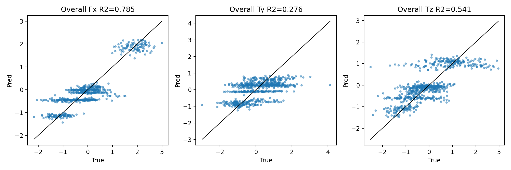

Low- and high-mass FT prediction are separated here:

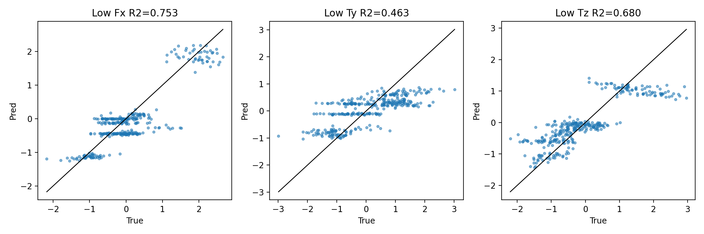

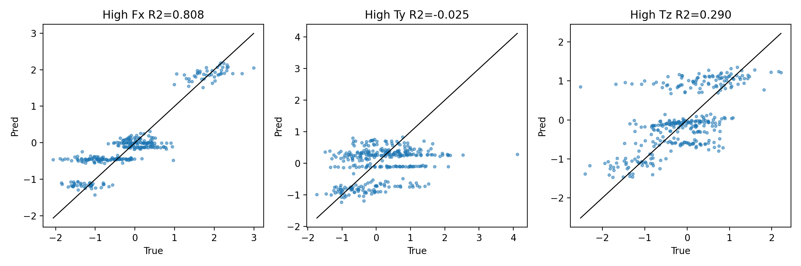

## Reconstruction and Alignment

The flower autoencoder reconstructs the mean flower position/velocity very well (`R2 = 0.9987`). Cross-flower reconstruction from the shared spike latent is lower but still substantial (`R2 = 0.7414`), indicating that the spike latent contains useful flower-state information.

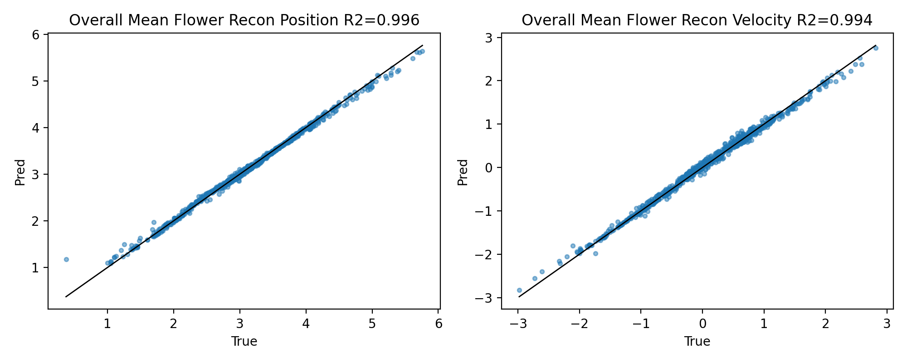

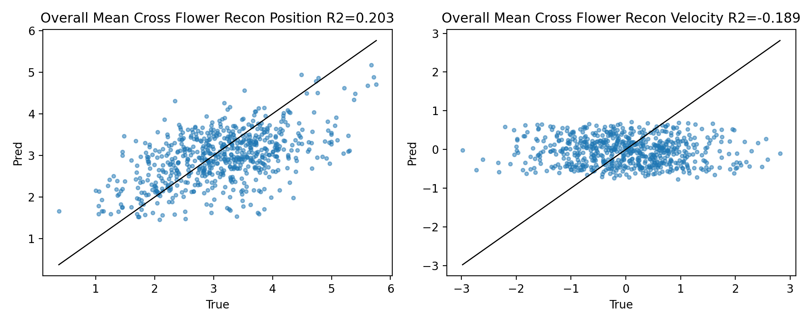

Spike reconstruction is modest (`R2 = 0.2831`), and cross-spike reconstruction is close to the direct spike reconstruction (`R2 = 0.2706`). This suggests that the flower-aligned shared dimensions retain much of the spike decoder-relevant structure despite the tight 3D spike bottleneck.

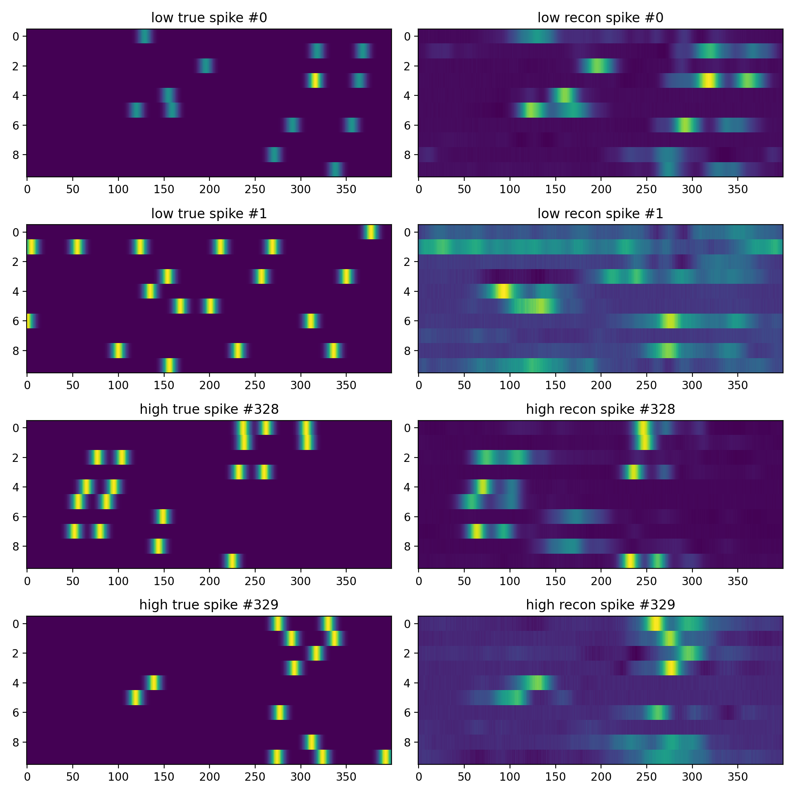

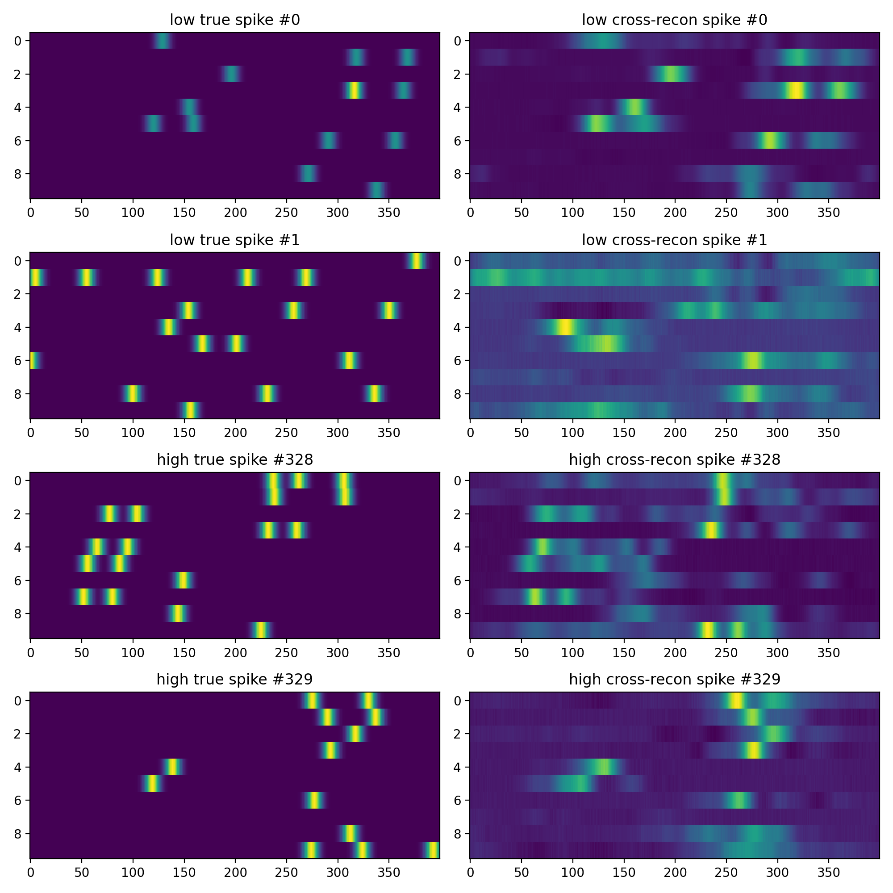

The mass classifier is strong, with 99.7% accuracy and well-separated low/high predicted probabilities.

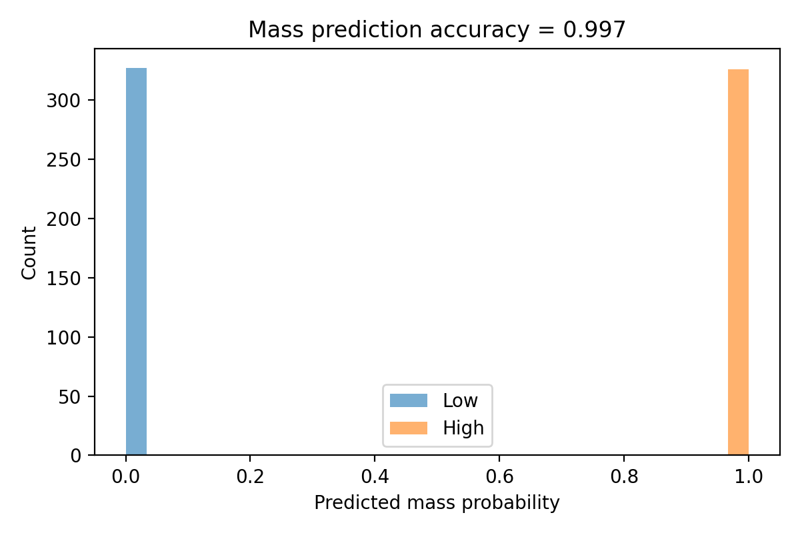

## Shared Latent Importance

The shared spike latent dimensions are important for spike reconstruction. Zeroing both shared dimensions reduced spike R2 from `0.2831` to `0.1560`, a drop of `0.1271`. The effect was much larger in the high-mass condition.

| Shared latent ablation | Delta spike R2 |
|---|---:|
| Both shared dims zeroed, overall | -0.1271 |
| Both shared dims zeroed, low mass | -0.0477 |
| Both shared dims zeroed, high mass | -0.1940 |
| Dim 0 zeroed, overall | -0.0492 |
| Dim 1 zeroed, overall | -0.0316 |

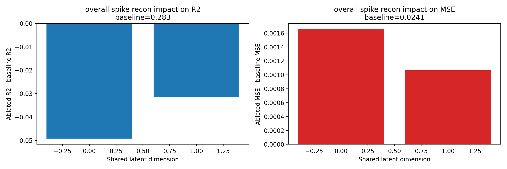

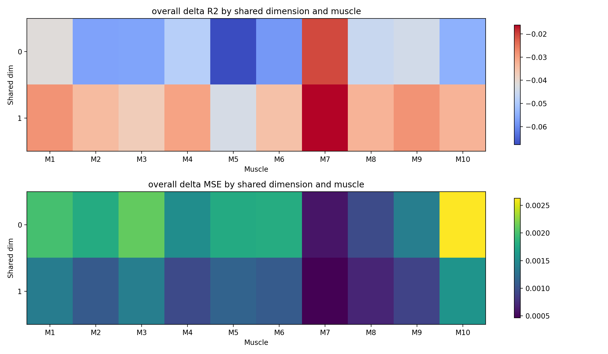

## By-Moth Evaluation

The new dataset contains 7 moths in this run. Per-moth metrics show that performance is not uniform across animals, which is expected given the per-moth FT heads and mass-dependent dynamics.

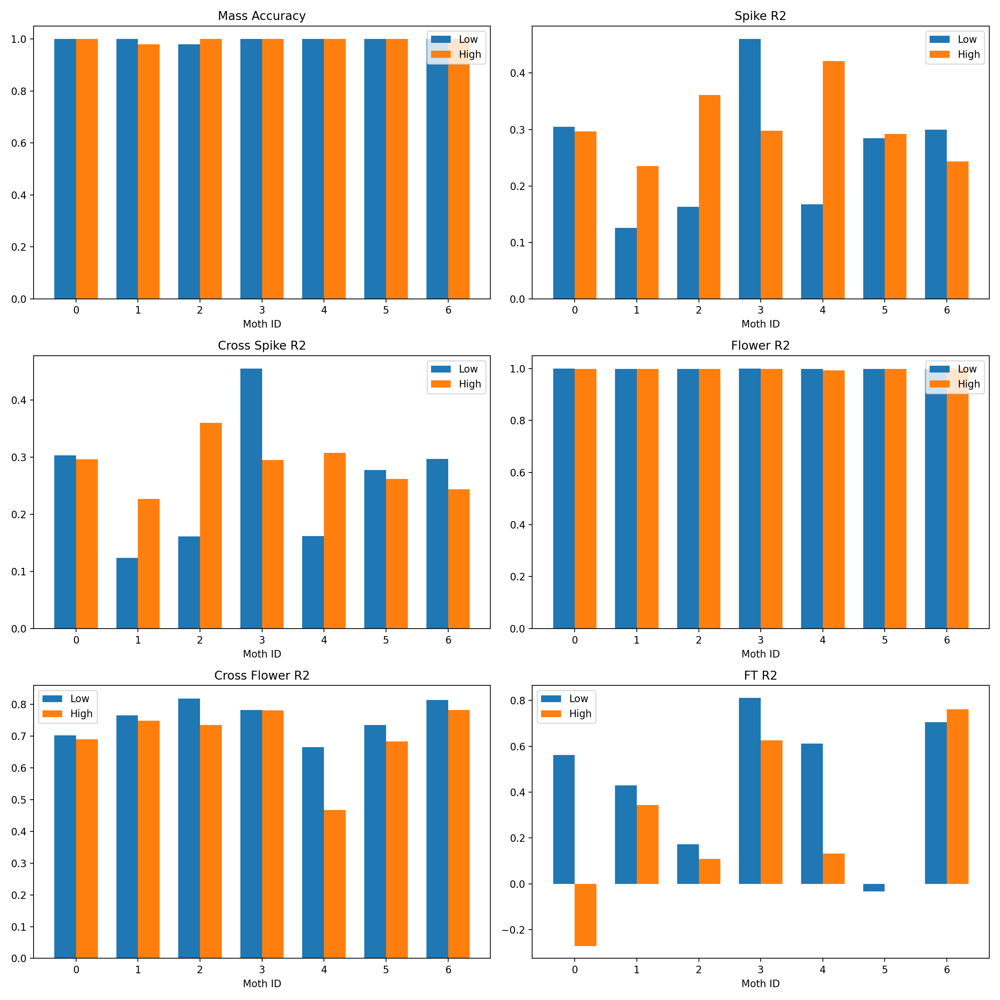

Example reconstructed and cross-reconstructed spike trains were saved for each moth:

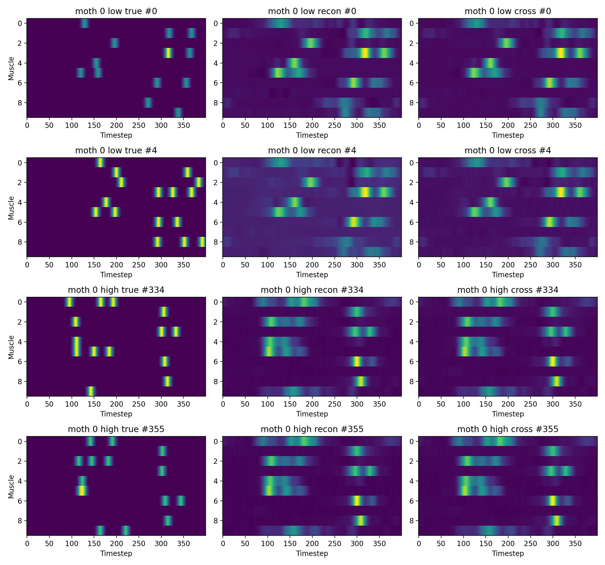

## Latent Sweep GIFs

The shared latent sweep varies both shared spike dimensions within each moth's observed latent range. The GIFs visualize how changing the shared latent affects cross-reconstructed spike trains, flower prediction, and FT prediction by moth.

Example:

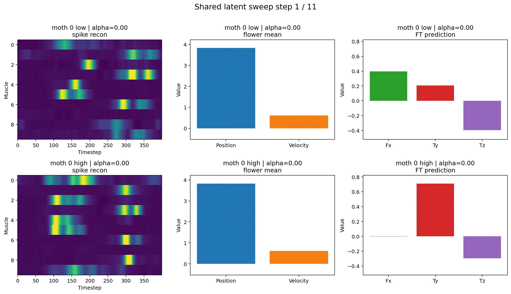

All sweep GIFs are in `shared_latent_sweep_by_moth/`.

## Summary

This new-data run is a strong improvement over the previous old-dataset run with the same `flower2/spike3` configuration. FT R2 improved from about `0.4803` to `0.5387`, and shared-latent ablation became more meaningful, with spike R2 dropping by `0.1271` when both shared dimensions were zeroed. The model reconstructs mean flower state very well, aligns spike-to-flower latents reasonably well, and learns mass almost perfectly. The main remaining weakness is FT prediction for `Ty`, especially under the high-mass condition.
